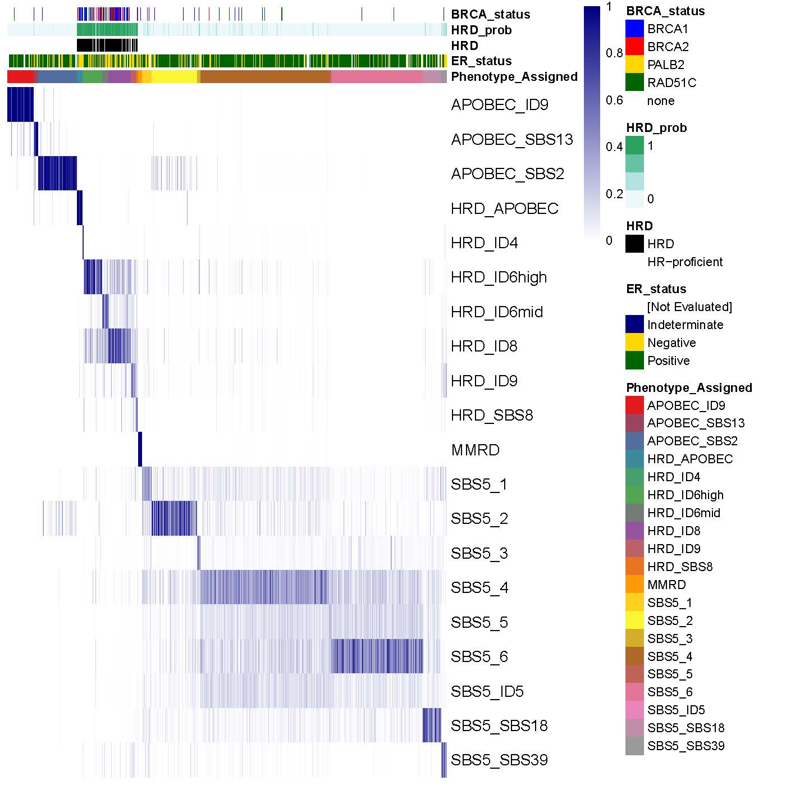

# Multiscale HRD classification

### Author: Daniel H Jacobson, UCL

This repository contains the workflow for classification of homologous recombination deficient breast cancers via mutational signature classification and transcriptomic signature approaches. Scripts are separated into these two groups, and are presented here in the order in which they must be executed.

# Scripts

## Exome Classifier

- **ICGC_BRCA_UKandEU_MatrixGeneration.R:** Collates mutation data from the BRCA-EU and BRCA-UK projects and uses the sigminer R package to collate the mutational spectra of each sample according to the SBS96 and ID83 signatures.
- **ICGC_deconstructSigs.R:** Calculates contributions of breast cancer-associated SBS and ID mutational signatures to each of the ICGC samples, establishing the signature profiles of each sample.
- **ICGC_PhenotypeClusterDevelopment.R:** Applies finite mixture modelling to cluster the ICGC samples depending on their signature profiles, and enables name assignment to each cluster generated based on their most prevalent signature contributions.
- **PriorCluster_Generation.R:** Collates the signature profiles for all samples within a cluster and generates a mean mutational spectrum representative of them, therefore generating the probability distributions for each cluster.
- **TCGA_HRDclassification.R:** Using the prior probabilities and likelihoods generated using ICGC, we collate the mutational profiles of 986 exome sequenced breast cancers from TCGA and calculate the posterior probabilities of assignment to each of the ICGC-generated clusters. The sum of probabilities of assignment to the HRD-associated clusters equals to the probability of HRD.
- **HRD_Hallmarks.R:** Comparison of HRD and HR-proficiency assignments in TCGA to HRD-associated features (Myriad HRD score, CX3 copy number signature contribution, POLQ expression, proliferation capacity)

## TranscriptionalSignature

- **TCGA_BRCA_RNAseq_preProcessing.R:** Pre-processing of TCGA-BRCA expression data including removal of lowly expressed genes, regression against tumour purity, and separation into training (~2/3) and testing (~1/3) cohorts. This includes both HRD/HR-proficiency assignment according to the exome classifier, as well as BRCA1/BRCA2/HRD_BRCA+/HR-proficiency classifications which are used for signature development.
- **Multinomial_ElasticNet_lambdaMin_1to500.R:** Performs 500 iterations of 10-fold cross-validated multinomial elastic net regression. On each iteration, the gene parameter coefficients are saved. To run all 1000 iterations, a second script was run in parallel with the seed set at (500+i) for each iteration.
- **TemplateFormation_ElasticNet.R:** Collates the coefficients from the 1000 iterations of elastic net regression and extracts the 130 genes which appear as non-zero in all of them. The median expression of each gene is calculated across te HRD/HR-proficiency and HRD/BRCA-defect groups to generate the templates.
- **TCGA_BRCA_testing.R:** Correlate the TCGA-BRCA testing cohort against each of the templates, saving the Pearson's correlation coefficient which represents the associated 'score'. The 'HRD score' is calculated by subtracting the correlation with the HR-proficiency template against the correlation with the HRD template.
- **GSEA_pathfindR.R:** Runs gene set enrichment analysis using the pathfindR tool. To enable this, for each gene an ANOVA is run of correlation against the HRD/BRCA-defect group, with the significance saved and adjusted. 
- **Chung2017_singleCellvsBulk.R:** Separates the bulk and single cell expression profiles from the Chung 2017 single cell breast cancer atlas. The tumour cells are extracted from the single cell data. HRD scores are calculated for each sample and tumour cell, and the sample-wide HRD scores are compared with the mean scores generated in the individual tumour cells.
- **Qian2020_preprocessing.R:** Preprocessing of the Qian 2020 breast cancer cohort, including removal of cells with high cell stress and unreasonable gene counts, and normalisation of expression scores.
- **Qian2020_singleCellAnalysis.R:** Calculate HRD scores across individual cells from the Qian2020 cohort and compare % cells with HRD score > 0 across the samples and respective breast cancer types.
- **Pal2021_epithelialExtract.R:** Extract epithelial cells from samples within the Pal 2021 breast cancer cohort using EPCAM expression. Each sample is individually clustered and any clusters with median raw EPCAM expression > 0 are labelled as epithelial cells and saved.
- **Pal2021_singleCellAnalysis.R:** Collate all epithelial cells and cluster. Clusters containing heterogenous sample contributions are assigned as 'normal' and are removed. HRD scores across individual cells are calculated and % cells with HRD score > 0 are compared across samples and respective breast cancer types.

# Copyright

This code is free and is distributed in the hope that it will be useful, but WITHOUT ANY WARRANTY. See the GNU General Public License for more details.
