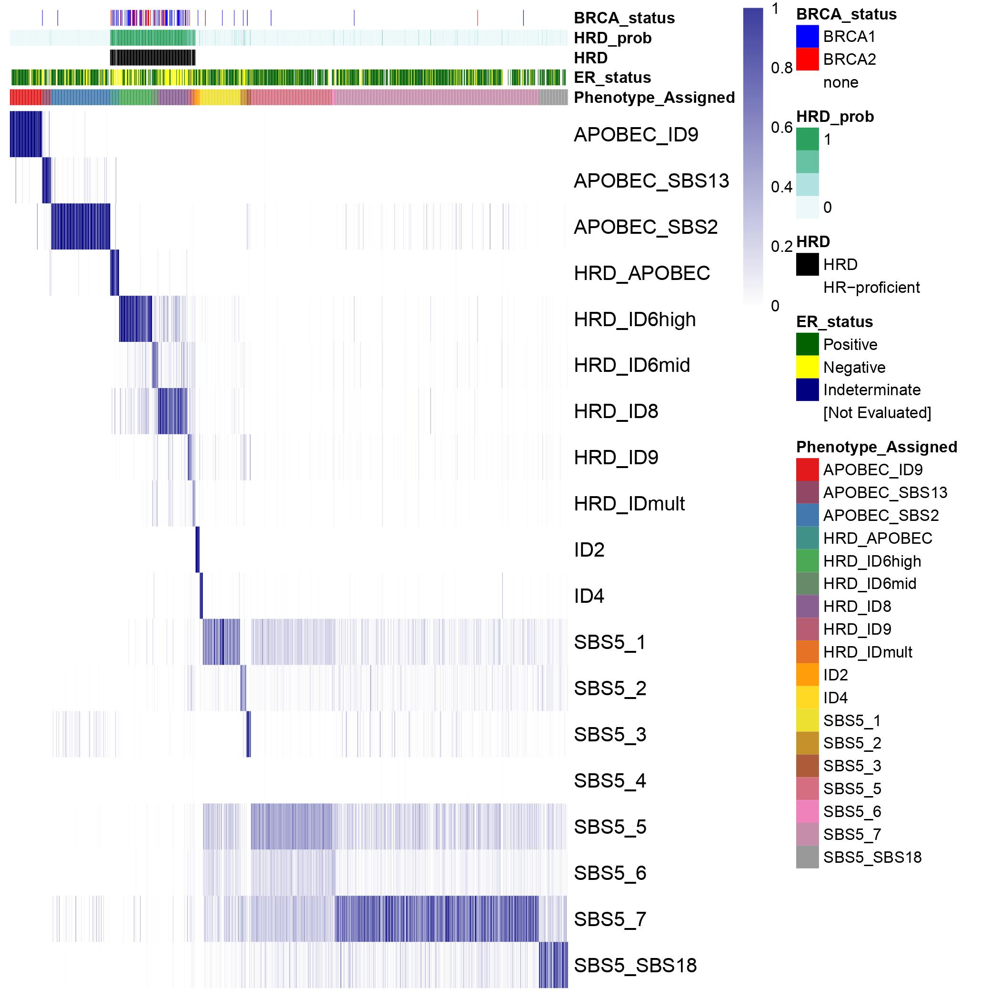

# Multiscale HRD classification

### Author: Daniel H Jacobson, UCL

This repository contains the workflow for classification of homologous recombination deficient breast cancers via mutational signature classification and transcriptomic signature approaches.

# Copyright

This code is free and is distributed in the hope that it will be useful, but WITHOUT ANY WARRANTY. See the GNU General Public License for more details.
